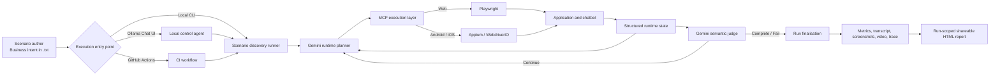
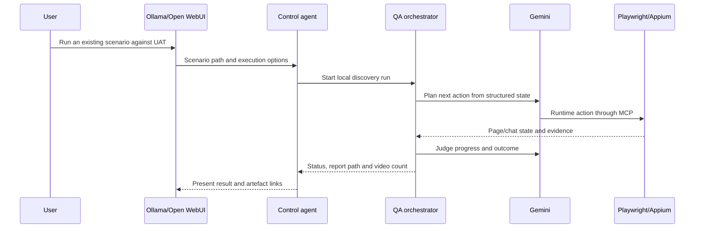
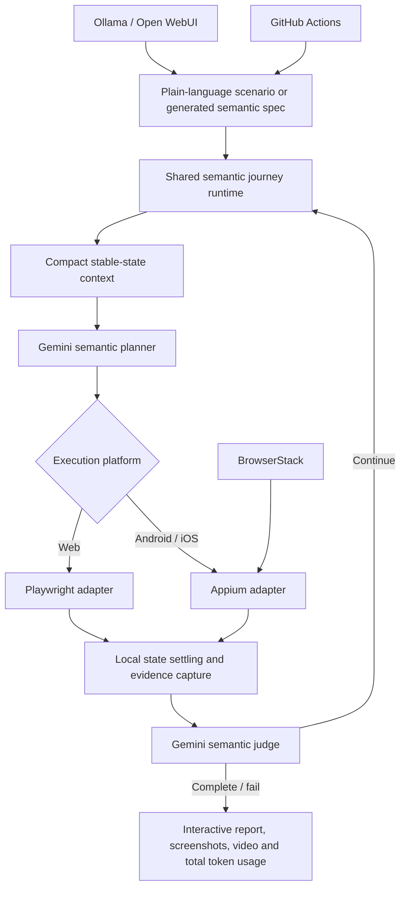

# Agentic QA Orchestrator

A business-intent QA framework that converts concise `.txt` scenarios into adaptive web and mobile test execution. The framework keeps scenario intent separate from execution mechanics: Gemini plans and judges, while Playwright or Appium performs the actual UI actions.

## Architecture



## Core principles

- Scenario files describe business goals, not CSS selectors or hardcoded click sequences.
- Runtime controls are discovered and referenced through temporary IDs.
- Gemini performs adaptive planning and semantic validation.
- Playwright/Appium executes actions deterministically.
- Evidence is isolated under a unique run directory.
- Ollama is used by the local control UI for authoring and launching scenarios; Gemini remains the runtime planner and judge.
- GitHub Actions runs the same scenario lifecycle in CI and can target local runners or BrowserStack.

## Execution paths

### Local CLI

```bash
npm run scenario:discover -- scenarios/web/reorderAddtoCart.txt
```

The local run records screenshots and video, writes metrics and transcript JSON, and creates a run-scoped shareable report.

### Ollama Chat UI



Ollama does not control the browser. It supports local scenario authoring, repository discovery and execution requests. Runtime decisions continue to use Gemini.

### GitHub Actions

The control agent can dispatch the configured workflow with scenario content, environment, execution target and BrowserStack options. CI uses the same discovery, execution, evidence and reporting lifecycle as a local run.

Typical inputs:

- `run_mode`: `scenario` or `spec`
- `run_target`: `local` or `browserstack`
- `target_env`: `UAT` or `PROD`
- `scenario_filename` and `scenario_content`
- BrowserStack browser, operating system, resolution and local-tunnel options

## Runtime flow

1. Load and validate the `.txt` scenario.
2. Resolve environment and execution target.
3. Authenticate inside the same browser context used for testing.
4. Capture structured chat and page state.
5. Ask Gemini for one generic action using runtime-discovered IDs.
6. Execute the action with Playwright/Appium.
7. Wait for page and chat surfaces to stabilise.
8. Ask Gemini to judge semantic progress from observable evidence.
9. Repeat until complete, blocked or failed.
10. Finalise video and evidence, then build the shareable report.

## LLM observability

Each planner and judge call records:

- provider and model
- configured temperature
- maximum output tokens
- prompt, output, cached and total tokens
- finish reason and retry attempt

Set `RUNTIME_LOG_LEVEL=summary` for concise terminal output or `RUNTIME_LOG_LEVEL=raw` for full MCP payloads.

## Artefacts

```text
reports/runs/<scenario>/<run-id>/
├── <scenario>.metrics.json
├── transcripts/<scenario>.transcript.json
├── screenshots/
├── videos/
└── <scenario>-<run-id>-report.html
```

## Useful commands

```bash
npm run scenario:discover -- scenarios/web/example.txt
npm run scenario:build-and-run -- scenarios/web/example.txt
npm run report:open
npm run test:web
npm run test:mobile:android
npm run test:mobile:ios
npm run check
```

## Token-efficient runtime context

The browser keeps the complete DOM-derived state locally. Gemini receives only a compact business context:

- a condensed scenario goal and acceptance conditions
- the latest meaningful chat messages
- newly added or changed controls first
- a bounded set of controls relevant to the scenario
- page/chat state deltas instead of repeated full snapshots
- a four-turn rolling decision history by default

Polling, waiting, screenshots, video recording, selector resolution and action execution remain local and do not consume Gemini tokens.

Recommended defaults:

```bash
RUNTIME_SCENARIO_SUMMARY_CHARS=3200
RUNTIME_MAX_RELEVANT_CONTROLS=12
RUNTIME_MAX_RELEVANT_TEXT_BLOCKS=8
RUNTIME_MAX_NEW_MESSAGES=5
RUNTIME_HISTORY_TURNS=4
RUNTIME_MAX_OUTPUT_TOKENS=1200
RUNTIME_LLM_TEMPERATURE=0.1
RUNTIME_LOG_LEVEL=summary
```

Use the report's **Token usage and efficiency** section to compare planner and judge consumption, average tokens per call and peak request size. Increase the limits only when the reduced context prevents the planner from seeing a required control or instruction.

## Stakeholder-friendly report

The shareable report presents the run as a business journey rather than a raw execution dump. Each checkpoint shows:

1. what the customer typed or selected
2. what the chatbot returned
3. the expected progress
4. whether progress was made
5. why the semantic judge accepted or rejected the response
6. the evidence used for the decision

Technical state deltas and the exact compact JSON sent to and returned by Gemini are available in expandable sections. Search and status filters allow product, QA and engineering users to review the same report at the appropriate level of detail.

### Runtime state settling

The runtime polls Playwright locally after each browser/chat action and calls Gemini only after a meaningful state change is stable. This prevents transient empty chatbot states from being judged as blocked and avoids additional LLM token usage during polling.

```bash
RUNTIME_STATE_SETTLE_TIMEOUT_MS=65000
RUNTIME_STATE_POLL_INTERVAL_MS=750
RUNTIME_STATE_STABLE_POLLS=2
RUNTIME_BLOCKED_MIN_WAIT_MS=15000
```

The shareable HTML report shows only the total LLM token usage at the bottom. Detailed per-request usage remains available in the metrics JSON for engineering analysis.

## Cross-platform semantic runtime

The framework uses one semantic decision model across web, Android and iOS. Platform code is limited to capturing state and executing actions; it does not contain brand- or scenario-specific conversation logic.



### Responsibility boundaries

- **Scenario/spec:** business objective, milestones, acceptance conditions and safety constraints.
- **Gemini planner:** decides the next customer message or selects a currently available runtime control by meaning.
- **Playwright/Appium:** performs browser or device actions, waits for stable state and captures evidence.
- **Gemini judge:** evaluates the final stable response semantically rather than matching exact wording.
- **Ollama/Open WebUI:** local authoring and execution entry point; it does not replace Gemini during runtime.
- **GitHub Actions:** runs the same semantic specs in CI, with BrowserStack available for hosted mobile devices.

Generated generative specs call `runSemanticJourney()` and therefore remain adaptive when chatbot wording, chips, intermediate questions or response ordering changes. They must not contain exact chatbot sentences, runtime control IDs or replayed fixed conversation turns.

### Mobile parity

The Appium MCP server exposes the same normalised runtime contract used by Playwright:

```text
capture state -> compact evidence -> semantic decision -> execute action -> local settling -> semantic validation
```

Native and webview state are normalised into messages, controls, inputs, text, screen/context and busy/readiness indicators. Polling and stability detection remain local and do not consume Gemini tokens.
